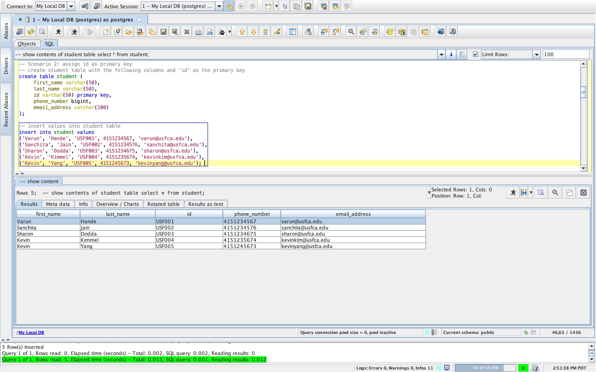
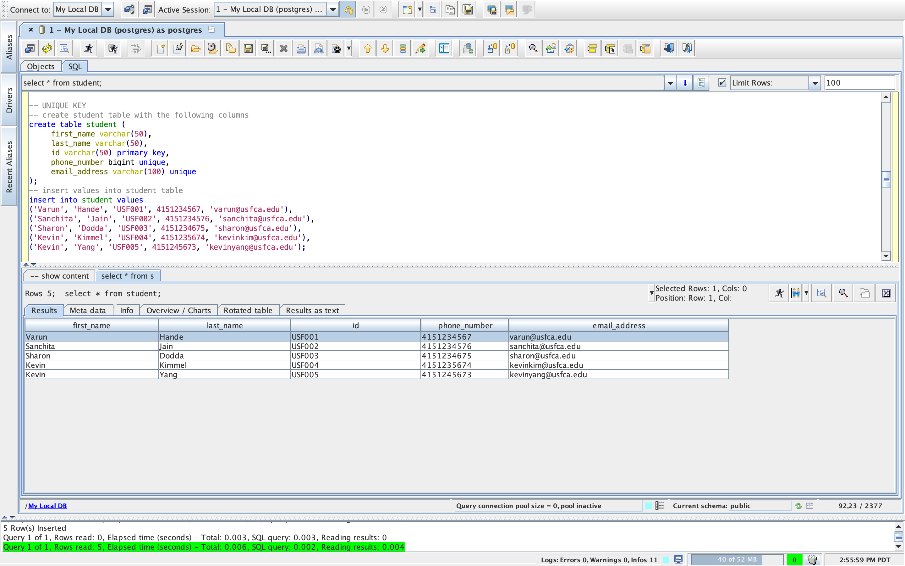
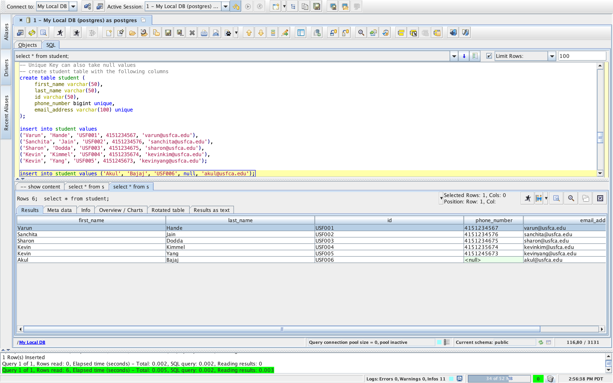
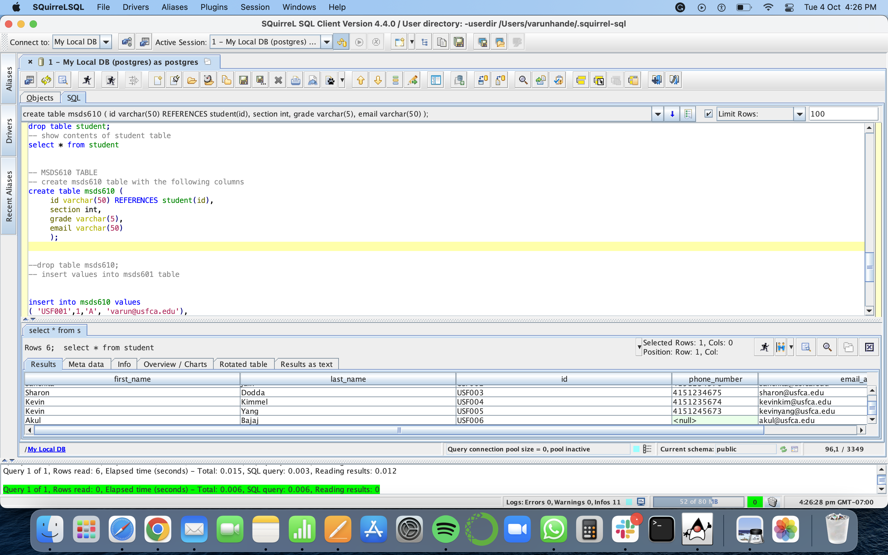
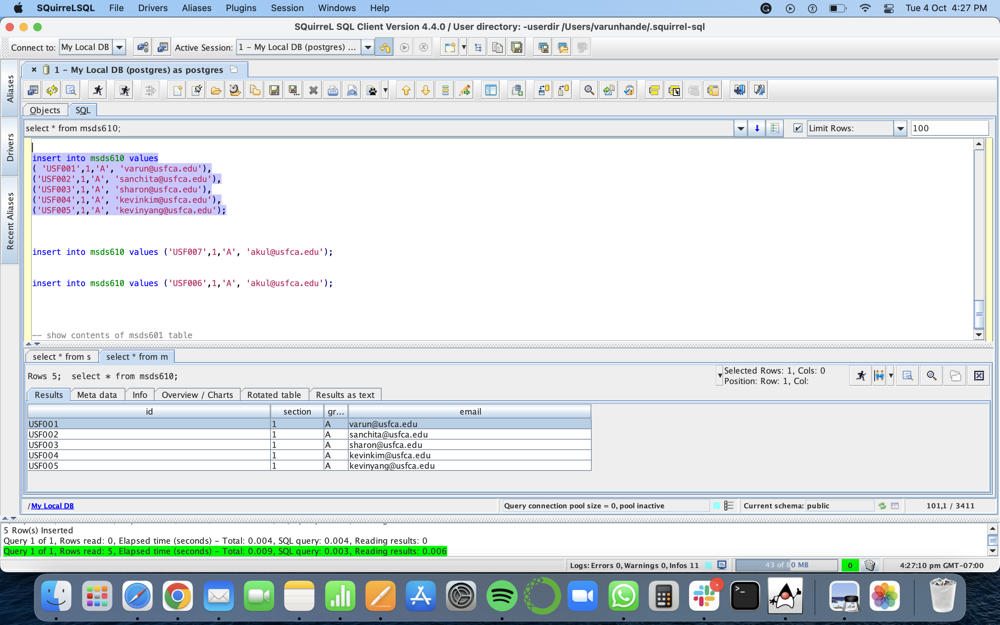
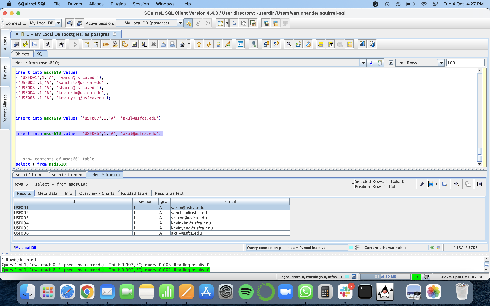

[Presented by: Sharon Dodda, Sanchita Jain, Varun Hande]

## Database Keys
This article explains the following database keys:  **Primary Key**, **Unique Key**, **Foreign Key**

Keys play an essential role in the relational database. It is used to uniquely identify any record or row of data from the table. It is also used to establish and identify relationships between tables.

**Primary Key**: A primary key is a key that can uniquely identify every record in a database table. The primary key contains unique values. It will not accept duplicate or null values. There can be only one primary key in a table.

**Unique Key**: A unique key refers to a column/a set of columns that identify every record uniquely in a table. All the values in this key would have to be unique. Remember that a unique key is different from a primary key. It is because it is only capable of having null values. A primary key, on the other hand, cannot have a null value.

**Foreign Keys**: Foreign keys are the column of the table used to point to the primary key of another table.

